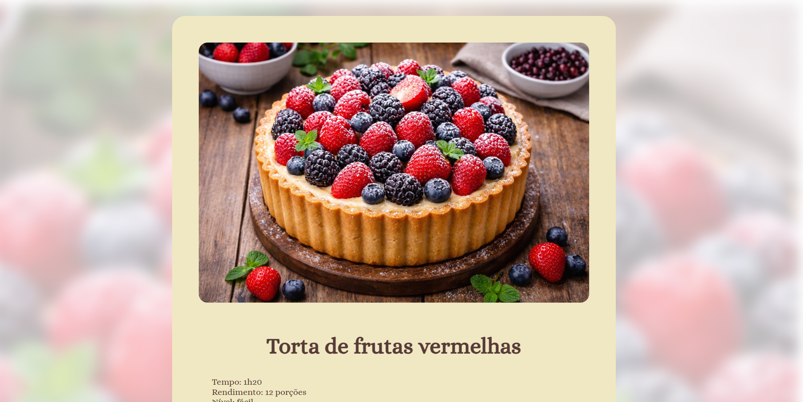

<h1 align="center"> Página de Receita</h1>

  

Este projeto consiste em uma página de receita desenvolvida como exercício prático de **HTML** e **CSS**, proposto pela Rocketseat. O objetivo é aplicar conceitos fundamentais de estruturação de páginas e estilização utilizando boas práticas de desenvolvimento web.

## Funcionalidades
- Lista de ingredientes
- Modo de preparo
- Layout organizado

## Tecnologias
- HTML5
- CSS3
- Figma

## Como executar 
Abra o arquivo `index.html` no navegador.

## Objetivo
Praticar os fundamentos de HTML e CSS, reforçando conceitos como:
- Estrutura semântica;
- Estilização com CSS;
- Organização de layouts;
- Interpretação de protótipos no Figma.
